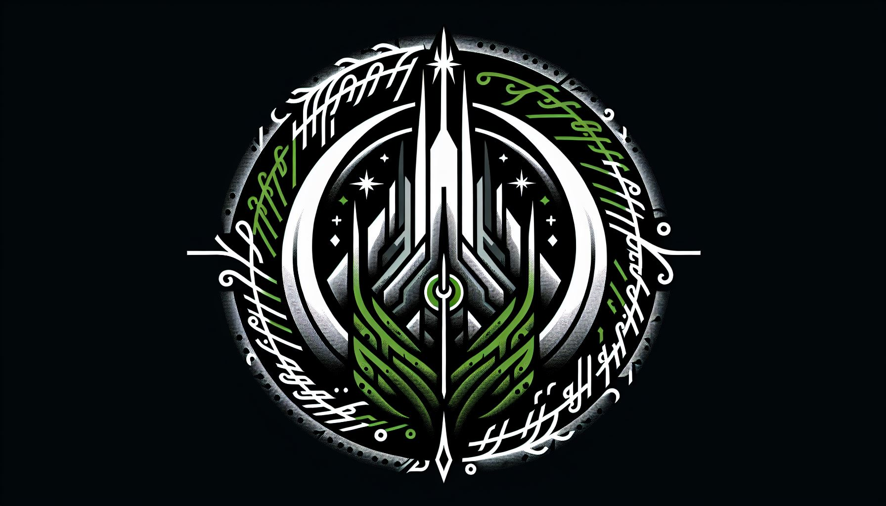

# Isengard

Custom Fedora Atomic Image for my Desktop and Laptops. This is my take on what the modern Linux Desktop should look like.

# Purpose

This is an image that is built on the work of [Universal Blue](https://github.com/ublue-os), [Bazzite](https://github.com/ublue-os/bazzite), and [Fedora Kinoite](https://fedoraproject.org/kinoite/) projects.

**This image is not recommended for general usage.**  I do not intend to do hardware enablement unless it's hardware I use specifically.

If you want images designed for general consumption, I suggest using [Bazzite](https://github.com/ublue-os/bazzite) or [Bluefin](https://github.com/ublue-os/bluefin) from the Universal Blue project.

# Features

These are the features included in my image!

## [Kernel Fsync](https://copr.fedorainfracloud.org/coprs/sentry/kernel-fsync)

This is a fixed Fedora Kernel that is used in Bazzite and Nobara. It helps improve performance and hardware enablement.

## Packages

In addition to [ublue-os/main](https://github.com/ublue-os/main), I include the following packages installed by default:

### Layered Packages (through RPM-Ostree)

#### [AKMODS](https://github.com/ublue-os/akmods)

A collection of kernel modules packaged by Universal Blue. These help with hardware enablement.

#### Gaming

- Patched Mesa and Pipewire (from Valve)
- Steam
- Protontricks

#### System Administrator

- Libvirtd, Qemu, and Virt-Manager
- Cockpit (disabled by default)
- Tailscale

#### Programming

- VSCode
- Prompt Terminal

#### Utilities

- Syncthing
- Linux Mint WebApp Manager
- System76 Scheduler
- Tuned
- OBS-VKCapture
- Mangohud

### System Flatpaks

#### Browser

- Firefox
- Google Chrome

#### Communications

- Slack
- Discord
- Element
- Signal

#### Programming

- Podman Desktop

#### Utilities

- VLC
- Bitwarden
- Flatseal

#### Gaming

- XIVLauncher (FFXIV Launcher)
- OSU Lazer
- Parsec
- Yuzu
- Dolphin Emulator

#### Design

- Inkscape

## How to Use the Image

If you do decide you want to try my image, you will want to rebase from Fedora Kinoite using this command:

```bash
rpm-ostree rebase ostree-unverified-registry:ghcr.io/noelmiller/isengard:latest
```

## Verification

These images are signed with sigstore's [cosign](https://docs.sigstore.dev/cosign/overview/). You can verify the signature by downloading the `cosign.pub` key from this repo and running the following command:

```bash
cosign verify --key cosign.pub ghcr.io/noelmiller/isengard
```

## Special Thanks

The contributors at Fedora and Universal Blue are amazing. This image would not exist without the incredible work they do every day!